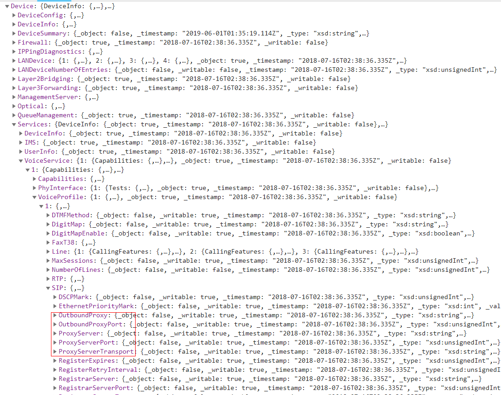
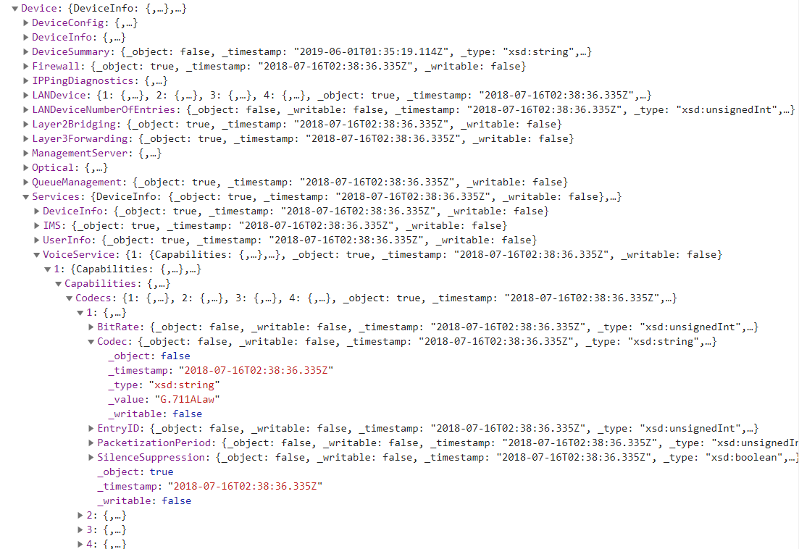
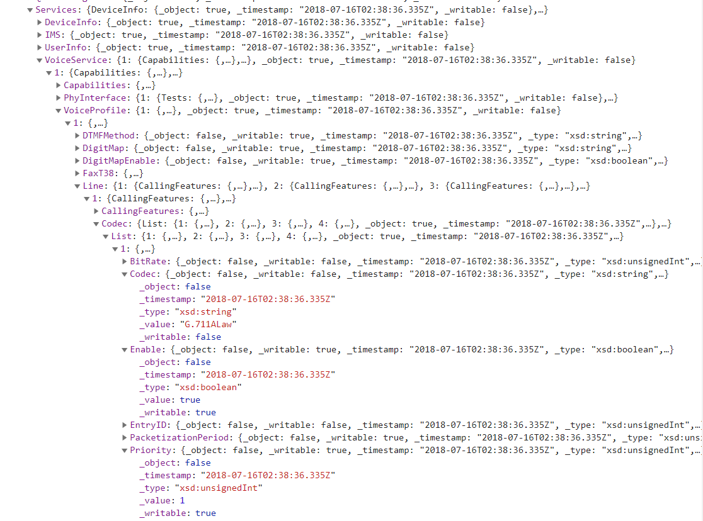
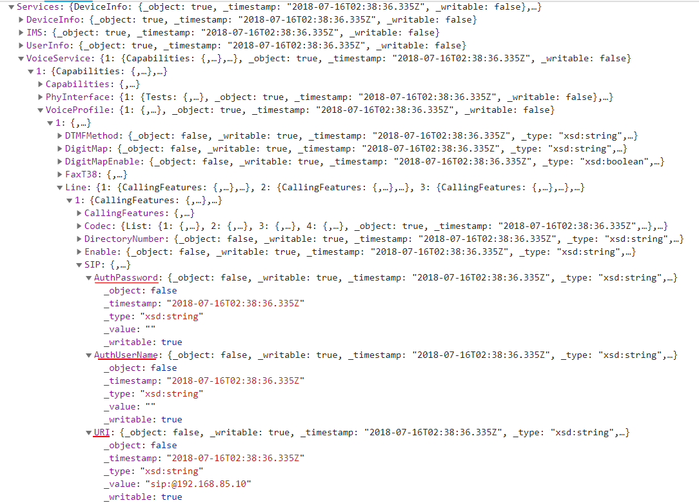

# IAD对应配置参数

## 前置条件
- **SIP设备选择企业后，调企业终端接入接口信息进行补全**
- **设备类型参数模型有两种**
  - TR-181 模型，参数以Device开头
  - TR-098 模型，参数以InternetGatewayDevice开头
  - **处理办法**
    1. 在设备连接上来后，判断是否存在Device属性，并写入表 **[建议]**
    2. 在添加界面增加选项来确定
- Device.Services.VoiceService.1.Capabilities.MaxLineCount 最大线路数
- Device.Services.VoiceService.1.Capabilities.MaxProfileCount 最多账号数
- **设备首次连接上来后刷新Device.Services.VoiceService对象**

##基本参数
- SIP 服务器
  - 获取终端接入信息(具体返回值在最下面)
  - Device.Services.VoiceService.1.VoiceProfile.1.SIP.OutboundProxy 值为 proxy.0.ip
  - Device.Services.VoiceService.1.VoiceProfile.1.SIP.OutboundProxyPort 值为 proxy.0.udp
  - Device.Services.VoiceService.1.VoiceProfile.1.SIP.X_GZB_OutboundProxyBak 值为proxy.1.ip（可能不存在）
  - Device.Services.VoiceService.1.VoiceProfile.1.SIP.X_GZB_OutboundProxyPortBak 值为proxy.1.udp（可能不存在）
  - Device.Services.VoiceService.1.VoiceProfile.1.SIP.ProxyServer 值为 domain
  - Device.Services.VoiceService.1.VoiceProfile.1.SIP.ProxyServerPort 默认值为5060
  - Device.Services.VoiceService.1.VoiceProfile.1.SIP.ProxyServerTransport 默认值为udp
  - **添加设备时应自动转换为上面的参数，不需要该选项**
    

- 拨号规则
  - 参数：Device.Services.VoiceService.1.Capabilities.DigitMap 为true时表示支持该功能
  - 参数：Device.Services.VoiceService.1.VoiceProfile.1.DigitMap 填写规则内容
  - **当有值时，设置Device.Services.VoiceService.1.Capabilities.DigitMapEnable为true**
  - **如果没有值是否需要设置为false？待确认？**

- 语音编码
  - 界面默认选项
    - 名称：G711A，值（编码名称Codec）：G.711ALaw或G711Alaw
    - 名称：G711U，值：G.711MuLaw或G711Mulaw
    - 名称：G729，值：G.729或G729
    - 名称：iBLC，值：**待确认？**
    - 名称：OPUS，值：**待确认？**
    - **建议加个匹配库**
  - 配置流程
    - 判断Device.Services.VoiceService.1.Capabilities.Codecs是否存在子节点
      1. 不存在表示不支持该功能
      2. 遍历Device.Services.VoiceService.1.Capabilities.Codecs的子节点
          - 如果不存在子节点及表示不支持该功能
          - 存时找到名称及子节点编码，如下
            - Device.Services.VoiceService.1.Capabilities.Codecs.1.Codec 编码名称
            - Device.Services.VoiceService.1.Capabilities.Codecs.1 节点编码为1
          - 设置Device.Services.VoiceService.1.VoiceProfile.1.Line.1.Codec.List.N.Enable 为true **N表示上面的子节点编码**
          - 设置Device.Services.VoiceService.1.VoiceProfile.1.Line.1.Codec.List.N.Priority 为选择后的排序号
          - 设置其他未匹配中的List.N.Enable为false
    - 经测试，如果配置子节点编码不存在时，不会报错
    
    

- 传真编码
  - 目前只支持两种
    1. 透传
      - 参数：Device.Services.VoiceService.1.Capabilities.FaxPassThrough 值为true时表示透传
        **在接口上发现该参数是不可配置的**
    2. T38
      - 参数InternetGatewayDevice.Services.VoiceService.1.Capabilities.FaxT38 为 true表示支持该功能
      - 参数InternetGatewayDevice.Services.VoiceService.1.VoiceProfile.1.FaxT38.Enable 中true表示开启

- DTMF
  - 参数：Device.Services.VoiceService.1.VoiceProfile.1.DTMFMethod
  - **根据MaxProfileCount参数值来确定VoiceProfile.1.DTMFMethod中的1能有哪些值**
  - 可选值有RFC2833，InBand，SIPInfo

## FXS端口
- 如配置分机号为2002，则需要相应配置以下信息
  - Device.Services.VoiceService.1.VoiceProfile.1.Line.1.SIP.AuthUserName 为 2002
  - Device.Services.VoiceService.1.VoiceProfile.1.Line.1.SIP.AuthPassword 值需要调用vos分机号接口，查询出2002的密码
  - Device.Services.VoiceService.1.VoiceProfile.1.Line.1.SIP.URI 值为 2002@880006.dyqx.com 
  - **2002@880006.dyqx.com为 2002, @, 终端接入接口的domain 三者连接一起**
  - **需要建立分机号与设置关系表，用于查询出哪些分机号未分配**
  - **保存时判断分机号，是否已分配给其他设备使用**
  - **分机号如何对应用户线？超出后？**
  - **自动填充？**
    - 需要查询出哪些端口未被分配？
  - **导入？**
  

## 终端接入接口信息
  - 接口地址
    - http://vos-server-ip:6060/bss/policy/tenant/t-access.sip?tid=880006
  - 返回信息
    - {"data": {"domain": "880006.dyqx.com", "proxy": [{"tls": 5070, "ip": "192.168.78.201", "udp": 5067, "tcp": 5067}]}, "scode": 0, "smsg": "成功"}

##　其他问题
- 锁定？解锁？告警？
- 删除后需要做哪些事情？
- 告警日志？