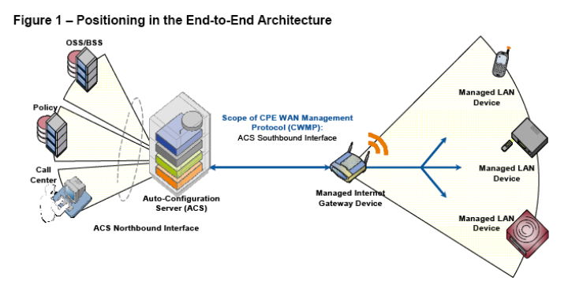
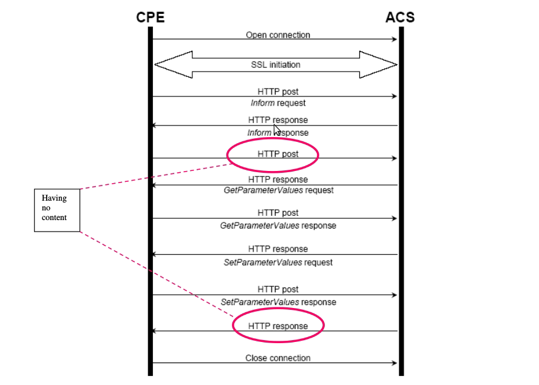

## 应用场景
- 随着运营商家庭网络业务的开展，将会有大量的设备需要安置在用户家中，如家庭网关、机顶盒、IP电话终端等，采用过去人工上门一对一服务的方式，对这些设备进行维护和管理将会花费大量的人力，形成巨大的负担。

## 基本介绍

- 该规范是应用层的管理协议，命名为“CPE广域网管理协议（CPE WAN Management Protocol）”。TR069定义了一套全新的网管体系结构，包括管理模型，交互接口及基本的管理参数，能够有效地实施对家庭网络设备的管理(如网关、路由器、机顶盒等设备)

  - 在TR069协议定义的网管模型中管理服务器称为自动配置服务器(ACS)，负责完成对用户终端设备(CPE)的管理
  - ACS与CPE之间的接口称为南向接口
  - ACS与运营商的其他网管系统、业务管理系统、计费系统(OSS/BSS)之间的接口称为北向接口
  - TR069协议允许 ACS 给一个 CPE 或一组基于多种标准的CPE 提供服务。这个服务提供机制允许 CPE 既可以在刚刚连接到宽带接入网时，也可以在以后的任何时间来进行动态服务提供或重新配置。此机制包括支持在异步状况下ACS 发起的服务。此协议包含的鉴权机制允许为每一台指定的 CPE 或基于相同的 CPE 供应商、型号、软件版本或其他标准的 CPE 组提供服务。同时也提供了一些可选的功能来管理那些有特殊级别安全需求的应用或业务，例如付费服务等。

| 协议栈 |
| ----- |
| CPE/ACS Management Application |
| RPC Methods |
| SOAP | 
| HTTP |
| SSL/TLS |
| TCP/IP |

## 工作要点
- 对于用户设备来说，TR-069主要完成以下四方面的工作：

  - 1.用户设备自动配置和动态的业务配置。对于ACS来说，每个用户设备可以在协议中对自己作出标志（例如型号、版本等），根据可设定的规则，ACS可以对某一个特定用户设备下发配置，也可以对某一组用户设备下发配置。CPE可以在开机后自动请求ACS中的配置信息，ACS也可在任意需要的时刻主动发起配置。通过该功能可以实现用户设备的“零配置安装”功能，或是可以从网络侧控制业务参数的动态改变。

  - 2.对用户设备的软件、固件的管理。TR-069的协议提供了对用户设备中的软件、固件进行管理和下载的功能。ACS可以识别用户设备的版本号，决定是否远程更新用户设备的软件版本，并且在更新完成后能够得知是否成功。例如，当用户设备需要加载新的软件以实现新的业务功能时，或是当前软件存在必须修复的bug时，通过该功能可以实现对用户设备的远程管理升级。

  - 3.对用户设备的状态和性能进行监测。TR-069定义了ACS对用户设备的状态和性能进行监测的手段。其中包括了一些通用的性能参数，可以反映当前用户设备的工作状态。另外还提供了标准的语法，运营商可以定义额外的参数。

  - 4.对通信故障的诊断。TR-069还定义了可以用户端自我诊断和报告的能力，例如在ACS的指示下，用户端可以通过ping或其它手段检查用户端与网络业务提供点之间的连通性、带宽等，检测结果返回给ACS。这样，运营商通过在远端操作，就可以对用户申告的设备故障进行简单定位，并作相应的处理。

## 安装

  [ACS](https://github.com/genieacs/genieacs)

  [ACSGUI](https://github.com/genieacs/genieacs-gui)

## 其他参考资料

  [TR-069 协议完整的通信过程](https://blog.csdn.net/Lock_Love_/article/details/48713243)
  
  
  [TR069协议详解](https://blog.csdn.net/ericfantastic/article/details/51542812)

  [TR069协议](https://blog.csdn.net/helloguoke/article/details/53883964)

  [零配置管理方案浅析](http://roll.sohu.com/20111123/n326582524.shtml)